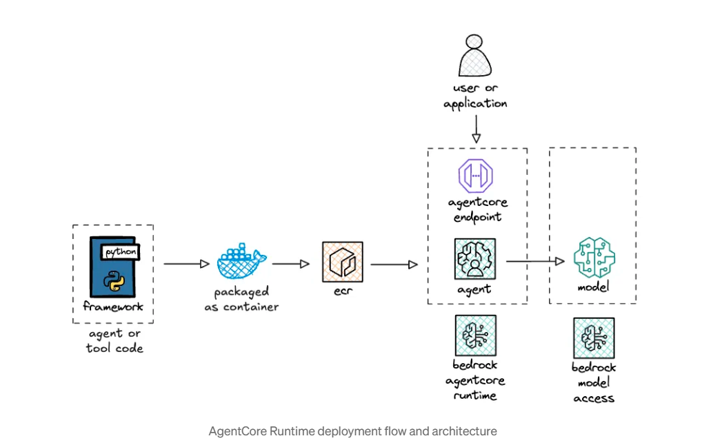

## Agent (Bedrock AgentCore) - AGENT_FOUNDRY

This folder contains a small example agent that uses the `strands` framework and an AgentCore runtime wrapper.

The agent demonstrates:
- A minimal `strands`-based agent defined in `agentcore_strands.py`.
- A lightweight test script at the repository root (`test_agentcore.py`) which invokes an AgentCore runtime using `boto3`.
- Dockerfile and dependency manifest for packaging the runtime.

## Quick overview

- Location: `./agent`
- Main agent entrypoint: `agent/agentcore_strands.py`
- Dependencies: `agent/requirements.txt`

## Prerequisites

- Python 3.10+ installed
- Pip
- (Optional) Docker installed to build the container image
- (Optional) AWS credentials configured if you plan to run the `test_agentcore.py` integration script or deploy the runtime to AWS

For local development it's recommended to use a virtual environment.

## Install (PowerShell)

````markdown
## Agent (Bedrock AgentCore) - AGENT_FOUNDRY

This folder contains a small example agent that uses the `strands` framework and an AgentCore runtime wrapper.

The agent demonstrates:
- A minimal `strands`-based agent defined in `agentcore_strands.py`.
- A lightweight test script at the repository root (`test_agentcore.py`) which invokes an AgentCore runtime using `boto3`.
- Dockerfile and dependency manifest for packaging the runtime.

## Quick overview

- Location: `./agent`
- Main agent entrypoint: `agent/agentcore_strands.py`
- Dependencies: `agent/requirements.txt`

## Prerequisites

- Python 3.10+ installed
- Pip
- (Optional) Docker installed to build the container image
- (Optional) AWS credentials configured if you plan to run the `test_agentcore.py` integration script or deploy the runtime to AWS

For local development it's recommended to use a virtual environment.

## Install (PowerShell)

Open PowerShell in the repo root and run:

```powershell
python -m venv .venv
.\.venv\Scripts\Activate.ps1
python -m pip install --upgrade pip
pip install -r agent\requirements.txt
```

This installs the Python dependencies used by the example agent.

## Running the agent locally

The example agent registers an entrypoint via a small runtime helper (`BedrockAgentCoreApp`) and exposes `app.run()` in `agent/agentcore_strands.py`.

To run it directly from the `agent` folder:

```powershell
cd agent
python agentcore_strands.py
```

Or from the repository root using the module path:

```powershell
python -m agent.agentcore_strands
```

Note: the example uses a mock `get_weather` tool and a `BedrockModel` instance placeholder. Update credentials and model configuration as needed for real usage.

## Tests / Integration

There is a simple integration script at the repository root: `test_agentcore.py`.
It demonstrates how to call an AgentCore runtime via `boto3` with a runtime ARN. This script requires:

- AWS credentials with permissions to call `bedrock-agentcore:InvokeAgentRuntime`.
- The correct `runtime_arn` set inside `test_agentcore.py`.

Run it from the repo root:

```powershell
python test_agentcore.py
```

If you don't have AWS access or a runtime ARN, skip this step — it's an integration example only.

## Docker

A `Dockerfile` is provided to build a runtime container image.

Build (from the `agent` folder):

```powershell
cd agent
docker build -t agentcore:local .
```

Run (example):

```powershell
docker run --rm -it agentcore:local
```

Adjust ports, environment variables, and entrypoints as required for your deployment.

## Infrastructure notes

Terraform config for pushing images and provisioning resources is located in the `infra/` folder. It includes ECR and other helper files. Typical workflow:

```powershell
cd infra
terraform init
terraform apply
```

Read `infra/README.md` for details and required `terraform` variables.

## Files of interest

- `agent/agentcore_strands.py` - example agent implementation and runtime entrypoint
- `agent/requirements.txt` - Python dependencies for the agent
- `agent/Dockerfile` - Docker image for the runtime
- `test_agentcore.py` - simple script showing how to invoke a deployed runtime via boto3
- `infra/` - Terraform infrastructure code (ECR, provider configs, outputs)
 

````
## Tracing

- 'agent/strands_agent_phoenix.py' - example of tracing
- Phoenix tracing is tested in local setup. Also We can host phoenix in ECS- Fargate
- docker pull arizephoenix/phoenix
- docker run -p 6006:6006 -p 4317:4317 -i -t arizephoenix/phoenix:latest
- 
<!-- Image reference for architecture diagram (place architecturee.png in this folder) -->


